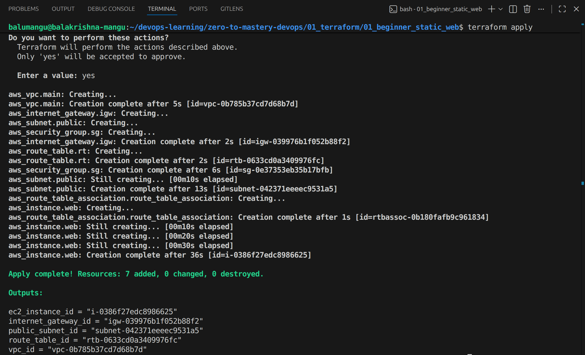
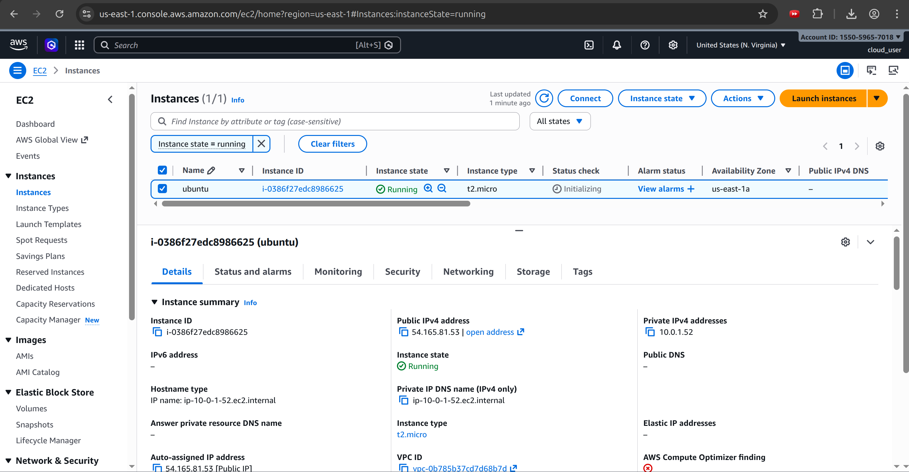
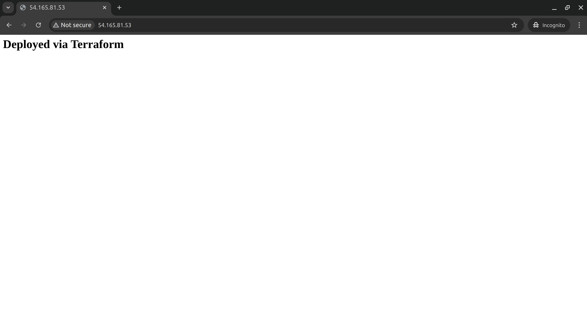

# Level 1: Static Web Architecture (AWS & Terraform)

## 🎯 Project Overview
This project serves as the foundational "Proof of Work" for Infrastructure as Code (IaC) using Terraform. I provisioned a complete, isolated AWS network and compute stack to host a functional web server. The goal was to move beyond manual console clicks and create a repeatable, declarative infrastructure.

## 🏗️ Architecture Breakdown
- **Virtual Private Cloud (VPC):** A dedicated network with a `10.0.0.0/16` CIDR block to isolate resources.
- **Public Subnet:** Configured with `map_public_ip_on_launch = true` to ensure external accessibility.
- **Internet Gateway (IGW) & Routing:** Created a gateway and custom route table to allow outbound/inbound internet traffic (`0.0.0.0/0`).
- **Security Group:** Implemented a stateful firewall allowing ingress on Port 22 (SSH) for management and Port 80 (HTTP) for web traffic.
- **EC2 Compute:** An Ubuntu 22.04 LTS instance bootstrapped with a `user_data` Bash script.

## 🛠️ Automated Provisioning (User Data)
To achieve "zero-touch" deployment, I used a bootstrap script to:
1. Update system packages.
2. Install and enable the Nginx web server.
3. Inject a custom HTML landing page to verify successful deployment.

## 🚀 Proof of Execution

### 1. Terraform Infrastructure Build
The terminal output confirms all 7 resources were successfully managed and created by the Terraform provider.

### 2. AWS Resource Verification
Verification from the AWS Console showing the instance in a 'Running' state with passed status checks.

### 3. Live Web Deployment
The final result: The Nginx server is live and reachable via the Public IP, displaying the custom Terraform-injected message.

## 🧠 Lessons Learned
- **Immutable Infrastructure:** I learned that `user_data` only executes on the initial launch. To update server logic, I practiced "tainting" or replacing the instance to ensure the environment stays consistent with the code.
- **Provider Resource Naming:** I discovered the difference between `security_groups` and `vpc_security_group_ids` when working within a VPC, preventing unnecessary resource recreation.
- **Variable Management:** Utilized a `variables.tf` file to keep the code modular and avoid hardcoding sensitive or environment-specific values.