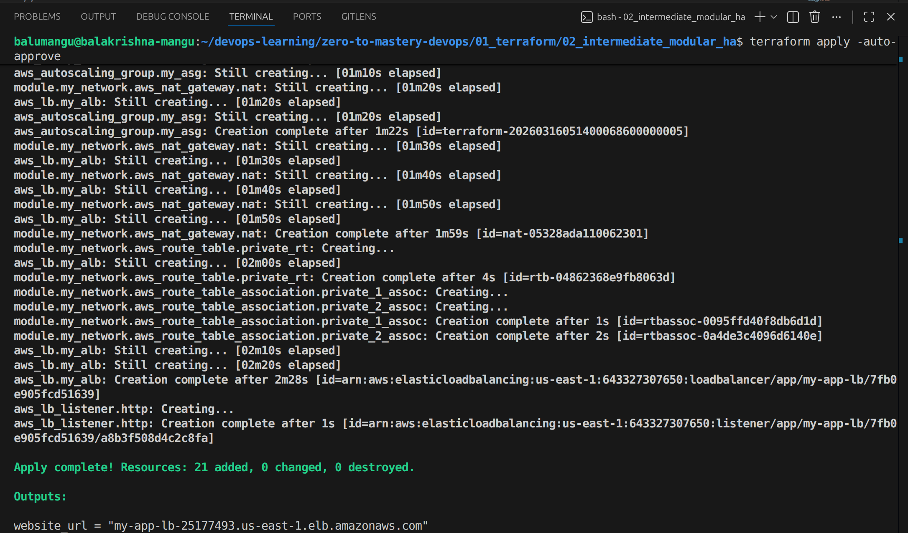
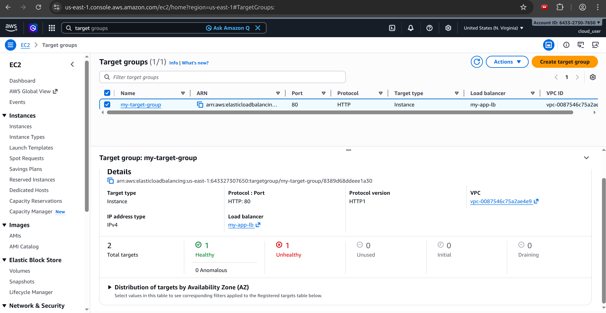
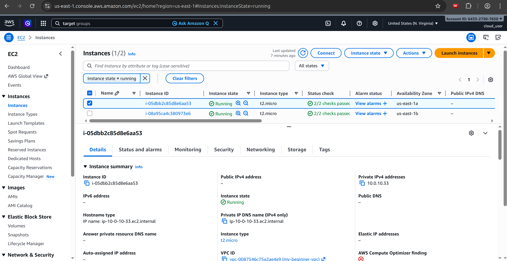
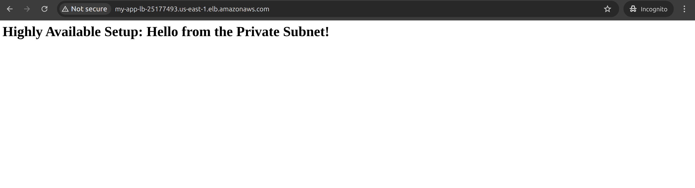

# Level 2: Highly Available 2-Tier Architecture (Modular Terraform)

## 🎯 Project Overview
This project upgrades the foundational static web architecture into a production-grade, Highly Available (HA) environment. The primary goal was to implement the DRY (Don't Repeat Yourself) principle by abstracting the networking layer into a reusable Terraform module. By migrating compute resources into private subnets behind a load balancer, this deployment demonstrates a strong focus on both scalability and security.

## 🏗️ Architecture Breakdown
- **Reusable VPC Module:** Abstracted the network creation (VPC, Subnets, Route Tables, Gateways) into a dedicated local module for future reuse.
- **Multi-AZ Deployment:** Infrastructure is distributed across two Availability Zones (`us-east-1a` and `us-east-1b`) to ensure fault tolerance.
- **Public & Private Subnets:** - **Public Tier:** Houses the Application Load Balancer (ALB) and NAT Gateway.
  - **Private Tier:** Secures the EC2 instances, ensuring they have no direct public IP addresses.
- **NAT Gateway & Routing:** Configured to allow private instances to securely reach out to the internet for package updates without exposing them to inbound traffic.
- **Application Load Balancer (ALB):** Serves as the single point of entry, terminating public web traffic and evenly distributing it to healthy backend targets.
- **Auto Scaling Group (ASG):** Utilizes a Launch Template to automatically manage a fleet of Ubuntu instances, maintaining a strict desired capacity of 2.

---

## 🗺️ Step-by-Step Execution & Architectural Rationale

To build this resilient architecture, I executed the deployment in five distinct logical layers. Here is exactly what was done and why this approach is an industry standard.

### Step 1: The Network Foundation (Modular VPC)
* **What I Did:** I created a custom VPC spanning two Availability Zones. Instead of hardcoding this into the main deployment, I built a standalone local module (`modules/vpc`) that explicitly defines two Public Subnets and two Private Subnets.
* **Why It’s the Best Approach:** This enforces the DRY principle. By abstracting the network into a module, I can spin up an identical, isolated network for a completely different application in the future just by calling the module and passing in new CIDR block variables.

### Step 2: Traffic Routing & Egress (IGW & NAT)
* **What I Did:** I attached an Internet Gateway (IGW) to the Public Subnets. For the Private Subnets, I provisioned an Elastic IP and a NAT Gateway located in the public tier, then updated the private route tables to point outbound traffic to the NAT.
* **Why It’s the Best Approach:** Compute resources hosting application logic should never be directly exposed to the internet. The NAT Gateway allows the private servers to securely download OS updates and the Apache web server, while completely blocking any unsolicited inbound traffic from the outside world.

### Step 3: Defense in Depth (Chained Security Groups)
* **What I Did:** I created two distinct Security Groups. The `alb-sg` allows HTTP (Port 80) traffic from anywhere (`0.0.0.0/0`). The `ec2-sg`, however, does not accept traffic from public IP addresses; it only accepts inbound traffic originating from the `alb-sg`.
* **Why It’s the Best Approach:** This is a zero-trust network model. Even if a bad actor somehow bypassed the outer network routing, the web servers will drop their packets. The servers will physically only speak to the Load Balancer.

### Step 4: The Traffic Cop (Application Load Balancer)
* **What I Did:** I deployed an external ALB across the two Public Subnets, mapped it to a Target Group, and created a listener to forward incoming Port 80 traffic to that Target Group.
* **Why It’s the Best Approach:** An ALB provides a single, reliable DNS endpoint for users. More importantly, it constantly performs health checks on the backend servers. If a server in Availability Zone A crashes, the ALB instantly stops sending traffic to it and reroutes everything to Zone B, ensuring zero downtime for the user.

### Step 5: The Compute Fleet (ASG & Launch Template)
* **What I Did:** I defined an AWS Launch Template containing the AMI, instance type, and a base64-encoded `user_data` bootstrap script to install Apache. I then attached this template to an Auto Scaling Group placed in the Private Subnets, hardcoded to maintain exactly 2 instances.
* **Why It’s the Best Approach:** Moving from individual `aws_instance` resources to an ASG makes the infrastructure self-healing. If a server fails its health check or is manually deleted, the ASG automatically detects the missing capacity and spins up a brand new, fully configured instance to replace it without human intervention.

---

## 🚀 Proof of Execution

### 1. Terraform Infrastructure Build
The terminal output confirms the successful initialization of the local VPC module and the creation of the multi-tier resources.

### 2. AWS Resource Verification
Verification from the AWS Console showing the ALB Target Group recognizing the Auto Scaling Group instances as 'Healthy' across multiple AZs.

### 3. Private Subnet Isolation Verification
To prove the "Defense in Depth" strategy, this screenshot from the EC2 console confirms the instances deployed by the ASG are isolated in the private tier. They possess local private IPs but intentionally lack Public IPv4 addresses.

### 4. Live Web Deployment
The final result: The web server is reachable via the Application Load Balancer's public DNS URL, proving successful traffic routing to the private tier.

## 🧠 Lessons Learned
- **The Power of Modules:** I learned how to separate configuration from deployment. By building a reusable VPC module, I can now spin up identical networks for future projects just by passing in new variable values.
- **Enhanced Security Posture:** I transitioned from relying on Security Groups alone to utilizing network-level isolation. Placing compute resources in Private Subnets behind an ALB is a fundamental best practice for cloud security.
- **Dynamic Scaling vs. Static Servers:** I discovered the operational difference between defining a single `aws_instance` versus defining an `aws_launch_template` tied to an ASG, allowing the infrastructure to be self-healing.