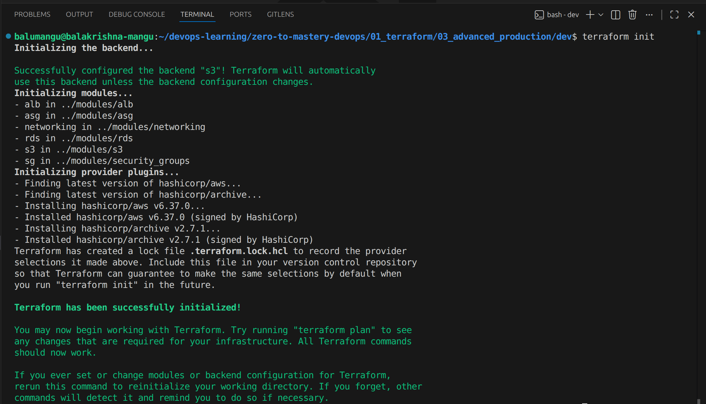
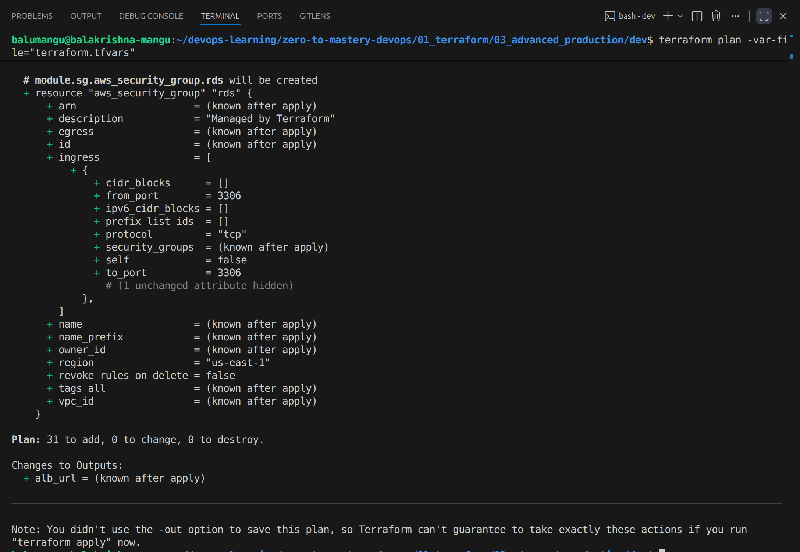
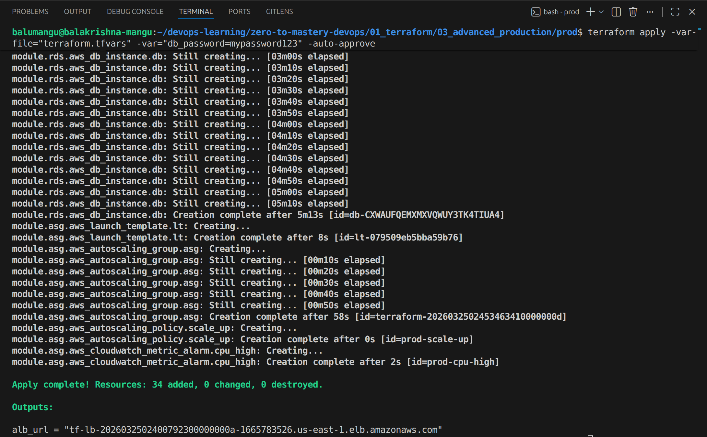

# 🏗️ Level 3: Production-Grade Highly Available Python App on AWS

## 🎯 Project Overview
This project provisions a production-grade, Highly Available Python web application on AWS using fully modular Terraform. The application accepts user registrations via an HTML form and persists the data to a MySQL database. The architecture enforces a strict zero-trust security model — no EC2 instance is publicly accessible, SSH is replaced entirely by AWS Systems Manager (SSM), and every layer only communicates with the layer directly behind it.

## 🏗️ Architecture Breakdown
- **Reusable Modules:** Every layer — networking, security groups, load balancer, compute, database, and storage — is abstracted into its own Terraform module with its own variables and outputs. Zero hardcoded values anywhere.
- **Two Environments:** `dev` and `prod` are driven entirely by `environments/dev.tfvars` and `environments/prod.tfvars`. The same module codebase serves both.
- **Multi-AZ Deployment:** All infrastructure is distributed across two Availability Zones (`us-east-1a` and `us-east-1b`) for fault tolerance.
- **Public Tier:** Houses the Application Load Balancer only. Nothing else is public.
- **Private Tier:** Houses EC2 instances (via ASG) and RDS MySQL. No public IPs. No open ports. No key pairs.
- **NAT Gateway:** Allows private EC2 instances to reach the internet outbound only — for SSM agent communication and pulling `app.zip` from S3 on boot.
- **ALB:** Single entry point. Distributes traffic to healthy EC2 instances. Runs `/health` checks continuously.
- **ASG + Launch Template:** Self-healing EC2 fleet. CloudWatch CPU alarms drive automatic scale-up and scale-down.
- **SSM Session Manager:** Replaces SSH entirely. No port 22 anywhere. Access private EC2s directly from AWS Console or CLI.
- **S3:** Stores Terraform state with native locking (`use_lockfile = true`, no DynamoDB needed). Also stores `app.zip` which EC2 pulls on boot.
- **RDS MySQL:** Private subnets only. Multi-AZ in prod for automatic failover.

---

## 🔒 Security Model

| From | To | Port | Allowed |
|------|----|------|---------|
| Internet | ALB | 80 | ✅ |
| ALB SG | EC2 | 5000 | ✅ |
| EC2 SG | RDS | 3306 | ✅ |
| EC2 SG | Internet | 443 | ✅ (SSM + S3 via NAT) |
| Anywhere | EC2 | 22 | ❌ Removed entirely |
| Internet | RDS | Any | ❌ |
| Internet | EC2 | Any | ❌ |

---

## 🗺️ Step-by-Step Execution & Architectural Rationale

### Step 1: The Network Foundation (`modules/networking`)
**What I Did:** Created a custom VPC spanning two Availability Zones with two public and two private subnets. Attached an Internet Gateway to the public subnets. Provisioned an Elastic IP and a NAT Gateway in `public_subnet_1`, then configured the private route table to send all outbound traffic through the NAT.

**Why It's the Best Approach:** No compute resource should be directly reachable from the internet. The NAT Gateway gives private EC2 instances one-way outbound access for SSM communication and pulling the application zip from S3 on boot — while completely blocking all unsolicited inbound traffic.

### Step 2: Defense in Depth (`modules/security_groups`)
**What I Did:** Created three chained security groups with locked-down egress. The `alb-sg` accepts HTTP port 80 from internet and sends only to EC2 on port 5000. The `ec2-sg` accepts only from `alb-sg` on port 5000, sends only to `rds-sg` on port 3306, and allows port 443 outbound for SSM and S3. The `rds-sg` accepts only from `ec2-sg` on port 3306 with no outbound rules.

**Why It's the Best Approach:** Every rule references a security group ID — not a CIDR range. This means even if someone obtained a private IP, they cannot reach the EC2 because the rule only allows traffic sourced from the ALB's security group. Each layer speaks only to the layer directly behind it — nothing more.

### Step 3: The Traffic Cop (`modules/alb`)
**What I Did:** Deployed an external ALB across both public subnets. Configured a Target Group on port 5000 with a `/health` health check. Created an HTTP listener on port 80 forwarding to the Target Group. The Target Group ARN is passed as an output to the ASG module for automatic instance registration.

**Why It's the Best Approach:** The ALB is the only public-facing component. It provides a single stable DNS endpoint regardless of how many EC2 instances are running. If an instance fails its health check, the ALB stops routing to it instantly while the ASG replaces it — zero downtime for the user.

### Step 4: The Self-Healing Compute Fleet (`modules/asg`)
**What I Did:** Defined an `aws_launch_template` with no key pair and no public IP. Attached an IAM instance profile granting `AmazonSSMManagedInstanceCore` for SSM access and `s3:GetObject` for pulling `app.zip` on boot. The `user_data` script downloads the zip from S3, unzips it, and starts the Flask app as a `systemd` service. CloudWatch CPU alarms drive scale-up and scale-down policies.

**Why It's the Best Approach:** Removing SSH entirely eliminates the most common attack vector on EC2 instances. SSM provides the same shell access through an encrypted tunnel with full audit logging — no open ports, no key management. Setting `health_check_type = "ELB"` means a running-but-broken Flask app still triggers replacement, not just a crashed VM.

### Step 5: App Deployment via S3 (`modules/s3`)
**What I Did:** A `null_resource` with a `local-exec` provisioner zips `app.py`, `templates/`, and `static/` into `app.zip` automatically during `terraform apply`. An `aws_s3_object` resource then uploads it to the app S3 bucket. The `triggers` block uses `filemd5` on all three source files so any change to the app automatically re-zips and re-uploads on the next apply.

**Why It's the Best Approach:** This eliminates heredoc app code inside `user_data` — a brittle pattern that breaks with special characters and makes the app impossible to update cleanly. With S3 as the delivery mechanism, updating the app is just `terraform apply` — no manual file copying to any server.

### Step 6: The Database Layer (`modules/rds`)
**What I Did:** Provisioned RDS MySQL 8.0 in a DB Subnet Group spanning both private subnets. The `multi_az` flag is driven by a variable — `false` in dev, `true` in prod — enabling a synchronous standby replica with automatic failover in production.

**Why It's the Best Approach:** RDS never has a public IP and is only reachable from the EC2 security group on port 3306. Multi-AZ in prod means AWS handles failover automatically within 60–120 seconds with no application changes required.

### Step 7: Two Environments, One Codebase (`environments/`)
**What I Did:** All environment-specific values live in `dev.tfvars` and `prod.tfvars` — different CIDRs, ASG sizes, CPU thresholds, and RDS Multi-AZ settings. The `db_password` has no default value so Terraform prompts for it interactively at `plan` and `apply` — it is never stored in any file.

**Why It's the Best Approach:** Strict separation of configuration from logic. Adding a new environment requires only a new `.tfvars` file — zero module changes.

---

## 🌍 Environment Comparison

| Setting | Dev | Prod |
|---------|-----|------|
| VPC CIDR | 10.0.0.0/16 | 10.1.0.0/16 |
| EC2 instance type | t2.micro | t2.micro |
| ASG min / desired / max | 1 / 1 / 2 | 2 / 2 / 6 |
| CPU scale-up threshold | 70% | 60% |
| RDS instance class | db.t3.micro | db.t3.micro |
| RDS Multi-AZ | false | true |

---

## 🚀 How to Deploy

```bash
# Initialise
terraform init

# Plan - you will be prompted for db_password
terraform plan -var-file="environments/dev.tfvars"

# Apply - you will be prompted for db_password
terraform apply -var-file="environments/dev.tfvars"

# Get the app URL
terraform output alb_dns_name

# Destroy when done
terraform destroy -var-file="environments/dev.tfvars"
```

---

## 🔗 How to Access Private EC2 via SSM

```bash
# From AWS CLI
aws ssm start-session --target <instance-id> --region us-east-1

# Or from AWS Console
# EC2 → Instances → Select instance → Connect → Session Manager → Connect
```

---

## 📸 Proof of Execution

### 1. Terraform Init


### 2. Terraform Plan


### 3. Terraform Apply Complete


### 4. S3 — State File and App Zip


### 5. ALB Active


### 6. Target Group — Both Instances Healthy


### 7. EC2 Instances — Private Subnets, No Public IP


### 8. SSM Session — Accessing Private EC2


### 9. RDS Available


### 10. Auto Scaling Group


### 11. Live App — Registration Form


### 12. Form Submission Saved to RDS


### 13. High Availability Test — ASG Self-Healing


### 14. Terraform Destroy Complete


---

## 🧠 Lessons Learned
- **SSM over SSH:** Removing port 22 entirely and using SSM Session Manager eliminates the most common EC2 attack vector while still providing full shell access with audit logging.
- **S3 as app delivery:** Using `null_resource` + `local-exec` to zip and upload the app during `terraform apply` means the app and infrastructure are deployed in one single command — no separate CI/CD step needed at this stage.
- **Locked-down egress:** Restricting EC2 outbound to port 3306 (RDS) and port 443 (SSM + S3 via NAT) means a compromised instance cannot be used to reach arbitrary internet destinations.
- **`filemd5` triggers:** Using `filemd5` on all app source files as ASG triggers means any code change is automatically detected, re-zipped, and re-uploaded on the next `terraform apply`.
- **Interactive password prompt:** Declaring `db_password` with no default forces Terraform to prompt interactively — keeping secrets completely out of version control without needing external secret managers.