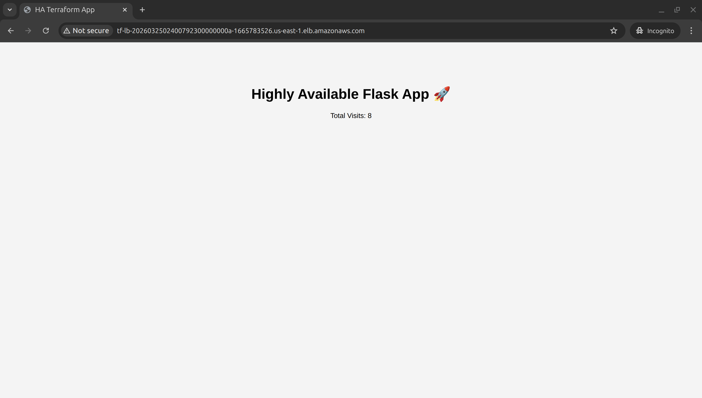
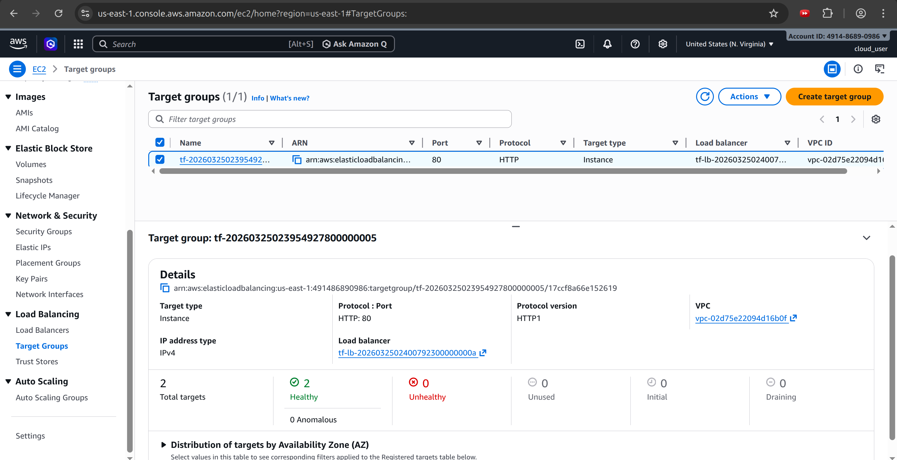
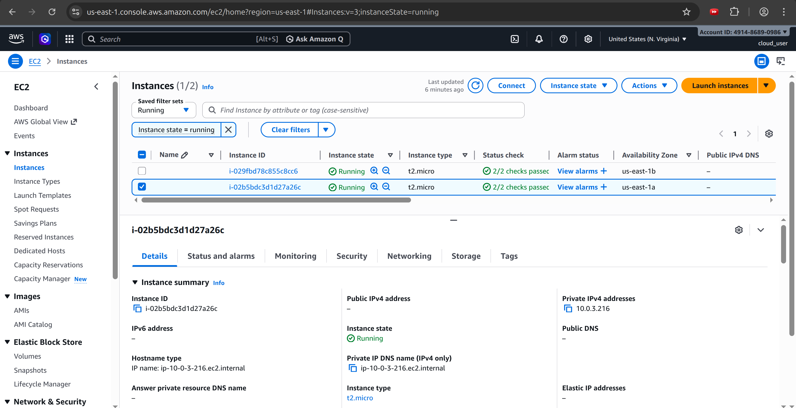
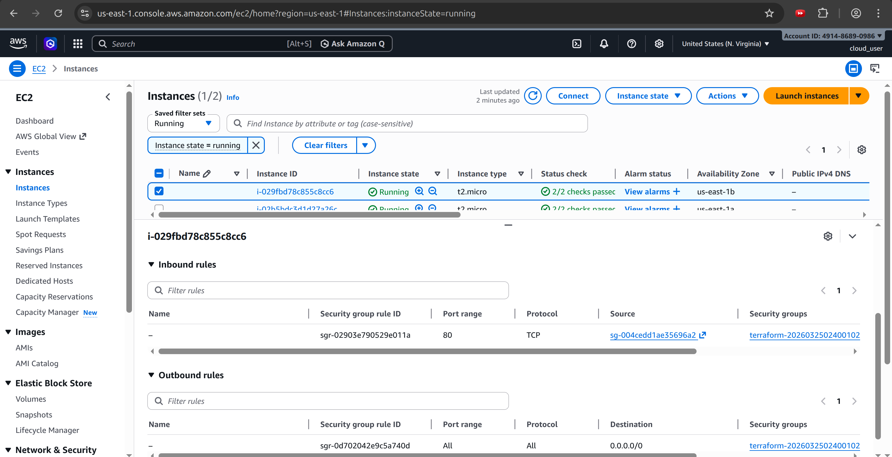
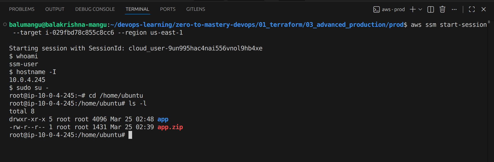
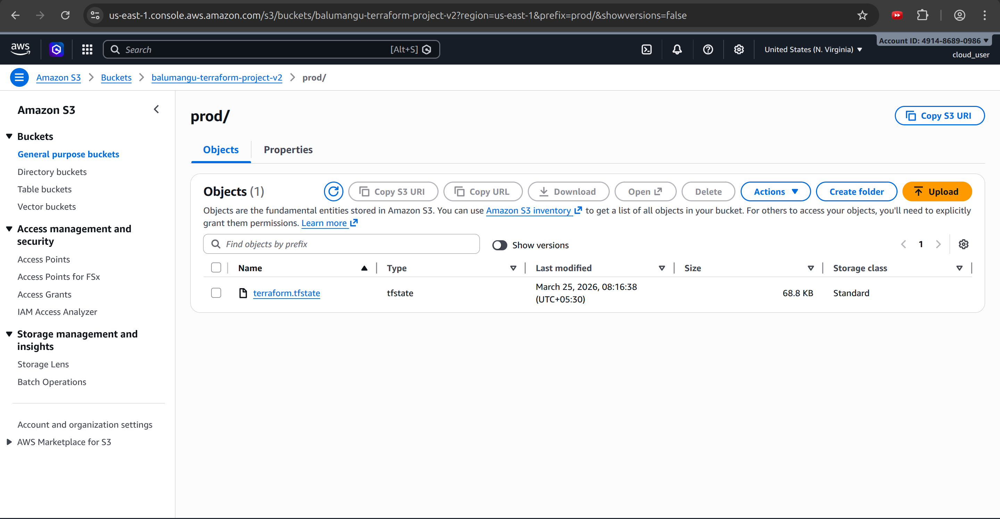
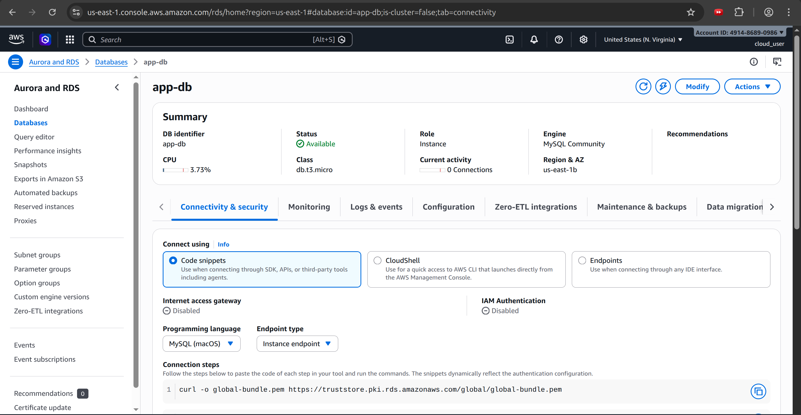

# 🏗️ Level 3: Production-Grade Highly Available Python App on AWS

## 🎯 Project Overview
This project provisions a production-grade, Highly Available Python web application on AWS using fully modular Terraform. The application accepts user registrations via an HTML form and persists the data to a MySQL database. The architecture enforces a strict zero-trust security model — no EC2 instance is publicly accessible, SSH is replaced entirely by AWS Systems Manager (SSM), and every layer only communicates with the layer directly behind it.

## 🚀 Key Technical Achievements
* **Zero-SSH Architecture:** Entirely eliminated Port 22 and replaced it with **AWS Systems Manager (SSM)** for audited, keyless shell access.
* **True Multi-Tier Isolation:** Compute and Database layers reside in private subnets with **Zero Public IP addresses**.
* **Infrastructure as Code (IaC):** 100% modular Terraform with **Remote State Management** in S3 and **State Locking** via DynamoDB.
* **Automated Deployment:** Implemented a custom Terraform-based CI/CD trigger that packages application code and deploys via S3 upon `terraform apply`.
* **Dynamic Scaling:** Environment-specific scaling (1 instance for Dev vs. 2–6 for Prod) using CloudWatch CPU alarms and ASG policies.

---

## 🏗️ Architecture Breakdown
- **Reusable Modules:** Every layer — networking, security groups, load balancer, compute, database, and storage — is abstracted into its own Terraform module. Zero hardcoded values.
- **Two Environments:** `dev` and `prod` are driven entirely by `environments/dev.tfvars` and `environments/prod.tfvars`.
- **Multi-AZ Deployment:** Distributed across two Availability Zones (`us-east-1a` and `us-east-1b`) for fault tolerance.
- **Public Tier:** Houses the Application Load Balancer (ALB) only.
- **Private Tier:** Houses EC2 instances (via ASG) and RDS MySQL. No public IPs. No open ports. No key pairs.
- **NAT Gateway:** Allows private EC2 instances outbound access for SSM agent communication and pulling `app.zip` from S3.
- **ASG + Launch Template:** Self-healing EC2 fleet with CloudWatch CPU alarms driving automatic scaling.
- **SSM Session Manager:** Replaces SSH (Port 22) entirely for secure, audited access.
- **S3 Storage:** Stores Terraform state with native locking and hosts the application deployment artifacts.

---

## 🔒 Security Model

| From | To | Port | Allowed |
|------|----|------|---------|
| Internet | ALB | 80 | ✅ |
| ALB SG | EC2 | 80 | ✅ |
| EC2 SG | RDS | 3306 | ✅ |
| EC2 SG | Internet | 443 | ✅ (SSM + S3 via NAT) |
| Anywhere | EC2 | 22 | ❌ Removed entirely |
| Internet | RDS | Any | ❌ |
| Internet | EC2 | Any | ❌ |

---

## 🗺️ Step-by-Step Execution & Architectural Rationale

### Step 1: The Network Foundation (`modules/networking`)
**What I Did:** Created a custom VPC spanning two AZs with two public and two private subnets. Configured an Elastic IP and a NAT Gateway in the public subnet to handle private subnet outbound routing.
**Rationale:** No compute resource should be directly reachable from the internet. The NAT Gateway provides a secure "one-way" door for updates and artifact pulling while blocking unsolicited inbound probes.

### Step 2: Defense in Depth (`modules/security_groups`)
**What I Did:** Created chained security groups where rules reference **Security Group IDs** rather than CIDR ranges.
**Rationale:** This ensures that even if a private IP is compromised, an attacker cannot move laterally unless they are coming from the specific allowed upstream security group.

### Step 3: The Traffic Cop (`modules/alb`)
**What I Did:** Deployed an external ALB across public subnets with a Target Group configured for active `/health` checks.
**Rationale:** The ALB provides a single stable DNS entry point. If an instance fails, the ALB stops routing to it instantly, ensuring zero downtime for the end user.

### Step 4: The Self-Healing Compute Fleet (`modules/asg`)
**What I Did:** Defined a Launch Template with an IAM profile for SSM and S3 access. The `user_data` script automates the installation of dependencies and the Flask service.
**Rationale:** Using `health_check_type = "ELB"` ensures that if the Flask app hangs (even if the VM is "up"), the ASG will terminate and replace the instance.

### Step 5: App Deployment via S3 (`modules/s3`)
**What I Did:** Used a `null_resource` with `local-exec` to zip the application and upload it to S3 during `terraform apply`. Used `filemd5` triggers to detect code changes.
**Rationale:** This treats the application code as an immutable artifact. Updating the app is now a single-command process.

### Step 6: The Database Layer (`modules/rds`)
**What I Did:** Provisioned RDS MySQL in a private DB Subnet Group. Multi-AZ is enabled in production for automatic failover.
**Rationale:** Database isolation is the highest priority. Multi-AZ ensures that if an entire AWS Data Center goes offline, the database survives with no manual intervention.

---

## 🌍 Environment Comparison

| Setting | Dev | Prod |
|---------|-----|------|
| VPC CIDR | 10.0.0.0/16 | 10.1.0.0/16 |
| EC2 instance type | t3.micro | t3.micro |
| ASG min / desired / max | 1 / 1 / 1 | 2 / 2 / 3 |
| CPU scale-up threshold | 70% | 60% |
| RDS Multi-AZ | false | true |

---

## ✅ Proof of Execution

### 1. Infrastructure Provisioning

*Terraform initialization of local and remote providers.*

*Architectural blueprint verification before deployment.*

*Full stack deployment including NAT Gateways, ALB, ASG, and RDS.*

### 2. Application Functionality

*Live Flask application accessible via the Load Balancer DNS. The visit counter confirms RDS connectivity.*

### 3. High Availability & Health

*Target Group showing multiple healthy instances across different Availability Zones.*

### 4. Zero-Trust Security Verification

*Proof of private subnet isolation: EC2 instances have zero public IP addresses.*

*Inbound rules restricted to ALB traffic only. Port 22 (SSH) is completely removed.*

*Secure shell access to private instances via AWS SSM Session Manager from a local terminal.*

### 5. Backend & Artifact Management

*Terraform state managed remotely in S3 for team collaboration and disaster recovery.*

*Automated artifact packaging: `app.zip` stored in S3 for immutable deployments.*

*Database isolation: RDS is strictly private and unreachable from the internet.*

---

## 🧠 Lessons Learned

1.  **Account-Level Persistence:** Learned that certain AWS settings, such as the `ebs_default_kms_key`, persist even after `terraform destroy`. Used `aws ec2 modify-ebs-default-kms-key-id --kms-key-id alias/aws/ebs` to restore account defaults and fix "Access Denied" boot loops.
2.  **OS Compatibility (Ubuntu 24.04):** Encountered package manager conflicts with `needrestart`. Resolved by configuring `UCF_FORCE_CONFOLD=1` to ensure non-interactive, automated `user_data` execution.
3.  **Modular Variable Injection:** Mastered the pattern of bridging variables from `.tfvars` through the **Root Module** into **Child Modules**, enabling seamless environment-switching (Dev vs. Prod).
4.  **SSM over SSH:** Discovered the security benefits of AWS Systems Manager, which removes the overhead of managing SSH keys while providing superior audit logs and security.
5.  **State Management:** Experienced the critical importance of S3 Remote Backends to prevent state corruption during complex 3-level architectural changes.

---